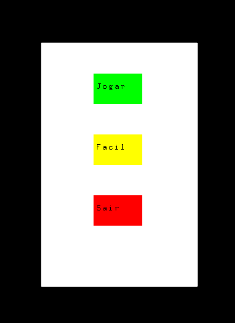
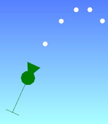
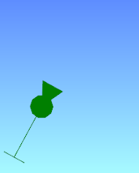
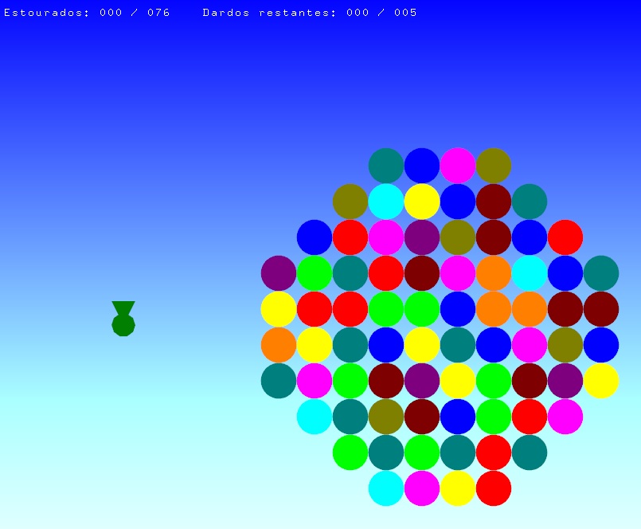
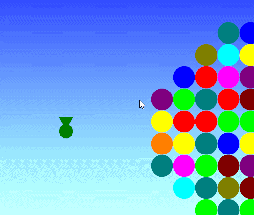
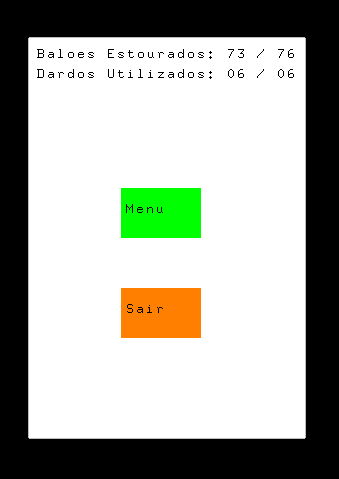

# cg_2021_t3

<h2> Descrição </h2>

O jogador controla um canhão e deve atirar projéteis. O jogador deve poder realizar a
rotação do canhão, além de possibilitar ao usuário modificar a “força” com que o canhão
dispara o projétil.

Critérios que serão avaliados:

- Classes em C++ para definição de vetores e transformações geométricas
- Sistema do controle do canhão
- Sistema de movimentação do projétil. De preferência utilize o mouse para isso.
- Colisão do projétil com os alvos (círculos)

Critérios básicos de interação:

- Controle da direção do canhão
- Controle da força de disparo

Extras:

- [ ] (+1,0) Tipos diferentes de tiros (efeitos especiais, pesos diferentes, etc.).
- [ ] (+2,0) Tipos diferentes de alvos (alvos móveis, alvos que mudam trajetória do projétil, etc.).
- [ ] (+1,0) Inclusão de obstáculos, como ocorre no jogo.
- [ ] (+1,0) Base do canhão móvel.
- [ ] (+1,0) Criação de várias fases do jogo.
- [ ] (+2,0) Concatenação de matrizes de transformação.
- [x] Etc.

<h2> Getting Started </h2>

Toda a utilização do programa é feita com o mouse.

Para iniciar, compile o programa com a ferramenta CodeBlocks (Release 17.12). O programa só dispõe de uma fase, porém é possível alterar o formato dos balões a serem exbilidos ao editar a matriz `balloons_grid` no arquivo [Game.h](src/States/Game.h) e número máximo de dardos na variável estática `GameState::total_darts` no arquivo [main.cpp](src/main.cpp).

# Usabilidade

Ao iniciar o programa, o usuário poderá escolher iniciar o jogo imediatamente a partir da dificuldade escolhida, sair do jogo, ou, selecionar a dificuldade entre 'Fácil' ou 'Difícil'.

 
  

# Dificuldades

A única diferença entre a dificuldade Fácil e Difícil, será a exibição da curva de auxílio ao arrastar o canhão para se realizar o disparo, sendo essa presente na dificuldade Fácil, porém ausente na difícil.

 
  
  

# Interface

No canto superior, será possível vizualizar o número de balões estourados juntamente com o número total de balões (estourados/total) como o número de dardos utilizados ao lado do número total de dardos disponíveis (utilizados/disponíveis). Ao lado esquerdo, será possível visualizar o canhão o qual o jogador irá interagir e ao lado direito, os balões o qual o jogador deve estourar.

 
  

## Como jogar

Para jogar, basta pressionar e arrastar o botão esquerdo do mouse sobre o canhão, que imediatamente ele irá mostrar tanto a força como a trajetória a ser percorrida pelo dardo (Caso a dificuldade esteja configurada para 'Fácil'). Para disparar, é preciso soltar o botão pressionado que o dardo irá percorrer a trajetória mostrada. A direção do canhão corresponde ao inverso da posição do mouse.

A força pode ser obeservada pela 'Corda' a ser puxada na traseira do canhão, e o caminho é observado da sua saída até que o dardo atinja o chão. Caso a força escolhida pelo usuário serja muito pequena, o dardo não será disparado, assim como existe um limite superior que impede que o jogador efetue por exemplo, uma força infinita.

Quando a flecha do dardo estiver em contato com algum balão, este será copntado como estourado e será marcado um ponto no marcador de balões. Assim como, quando um dardo for lançado, esse dardo será contabilizado no contador de dardos. Enquanto um dardo estiver em trajetória, não será possível disparar outro ao mesmo tempo, ou seja, deve-se esperar o dardo ativo atingir o chão. 

 
  

O jogo só será encerrado quando ou todos os balões forem estourados, ou o número de dardos utilizados se igualarem ao total. Ao fim do jogo, será exibida uma tela de 'GameOver' exibindo como o jogador pontou no jogo. Nessa tela, será possível voltar ao menu principal para se jogar novamente, ou sair imediatamente do jogo.

 
  

